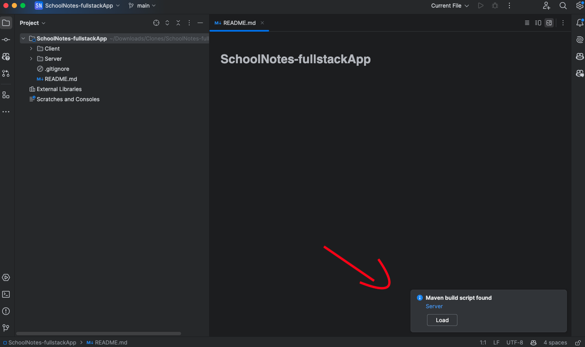
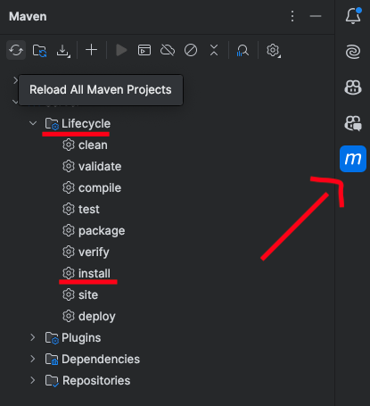
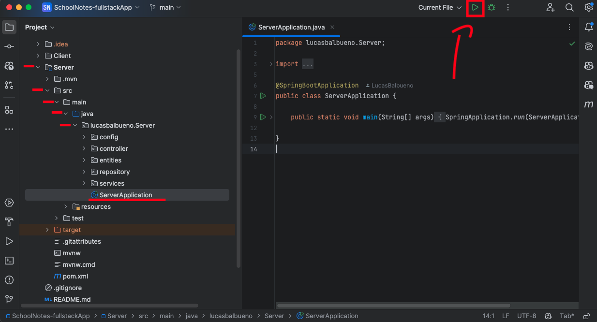
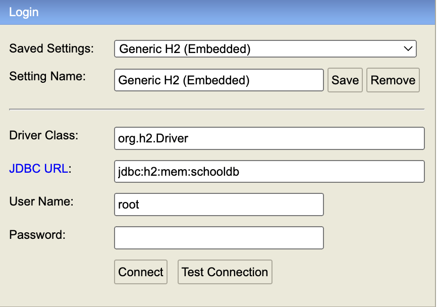

# SchoolNotes

SchoolNotes é uma aplicação web para gerenciar notas e frequência de alunos. A aplicação permite adicionar, visualizar e gerenciar informações dos alunos de forma simples e intuitiva.

## Funcionalidades

- Adicionar novos alunos;
- Deletar alunos;
- Visualizar lista de alunos;
- Visualizar notas e frequência de cada aluno;
- Visualizar média das notas da turma e média de frequência;
- Visualizar Lista de alunos com frequência baixa;
- Visualizar lista de alunos com a média acima da média de cada turma;

## Tecnologias Utilizadas

- React;
- TypeScript;
- Styled Components;
- React Router;
- React Icons;
- Input Mask;
- Axios;
- Java;
- Spring;
- JPA;
- Lombok;
- H2 Database;

## Sobre o projeto

Esse projeto full stack teve a sua API desenvolvida em Java com Spring e o banco de dados H2, esse banco de dados é armazenado em memória e possui sua interface gráfica no próprio navegador. Esse banco de dados é geralmente usado para testes e aplicações pequenas, sendo muito fácil a inicialização.

Já a parte do front-end foi desenvolvida em React com TypeScript e algumas dependências extras como o axios que foi utilizado para fazer as requisições da API.

O projeto funciona integrando toda a parte do Client (front end) com a parte do Server (back end) e para que ambas a parte funcionem corretamente é necessário seguir o passo a passo abaixo, assim como ter as ferramentas obrigatórias intaladas e configuradas.

## Requisitos obrigatórios

Antes de começar, você precisa instalar e configurar na sua máquina essas ferramentas obrigatórias para o funcionamento da aplicação.

- Java JDK na versão 17;
- Maven para gerencias o projeto e suas depêndencias;
- Alguma IDE de sua preferência (no passo a passo será utilizado o IntelliJ Community Edition e o VSCode);

## Como Executar o Projeto

#### 1. Clonar o Repositório

```bash
git clone https://github.com/LucasBalbueno/SchoolNotes-fullstackApp.git
```

#### 2. Abra seu IntelliJ na pasta clonada;

#### 3. Ao abrir o IntelliJ, um pop-up irá aparecer no canto inferior direito dizendo que encontrou algumas dependências do maven, basta cliclar em "carregar";


#### 4. Abra o console do Maven e vá para o projeto "Server", abra a pasta "LifeCycle" e aperte na opção "install";


#### OBS: Agora as dependências do Maven estarão baixando, se houver algum erro, verifique se você abriu o projeto na versão 17 do Java, caso precise instalar as dependências novamente, aperte na opção "clean" e depois em "install" novamente.

#### 5. Dentro do diretório do projeto, ainda no IntelliJ, abra a pasta Server > src > main > java > lucasbalbueno.Server, abra o arquivo "Server Application" e execute ele.


#### OBS: Agora a nossa API estará funcionando localmente na porta "http://localhost:8080/alunos".

#### 6. Após inicializar a nossa API, iremos abrir agora o VSCode na pasta clonada e digitar os seguintes comandos:

```bash
cd Client # para entrar na pasta do front-end;
```

```bash
npm install # para instalar todas as dependencias do React;
```

```bash
npm run dev # para o Vite inicializar a interface do app;
```

#### OBS: Executando esses comandos dentro da pasta Client, o seu navegador será aberto com a aplicação pronta para ser utilizada.

## Detalhes do projeto

- Sempre que o arquivo "Server Application" é executado o banco de dados é resetado, mantendo-se apenas o cadastro de um Aluno pré-configurado, como pode ser visto na interface gráfica, na aba "Alunos".

- Caso queira explorar o banco de dados, o H2 database possui uma interface gráfica no próprio navegador disponível na rota "http://localhost:8080/h2-console" onde é necessário digitar as credenciais e a senha "123", como na imagem a seguir:
